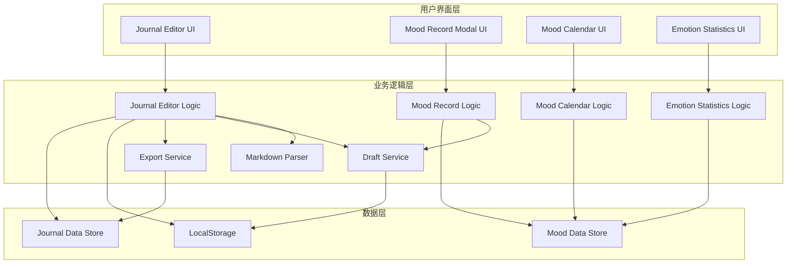

# 设计文档：日志编辑器增强

## 概述

本设计文档描述了日志编辑器和心情记录系统的增强方案，旨在提升用户体验至"大厂"级别。系统采用模块化架构，通过增强现有的 JavaScript 模块来实现 Markdown 预览、草稿保存、数据导出、动效优化和统计功能。

核心设计原则：
- **渐进增强**：在现有功能基础上增强，不破坏现有用户体验
- **性能优先**：所有动效和实时功能都需考虑性能影响
- **视觉一致性**：严格遵循 60-30-10 设计原则和 Tailwind 动效规范
- **数据安全**：本地存储和导出功能需确保数据完整性

## 架构

### 系统架构图



### 模块职责

**Journal Editor Module (journal-editor.js)**
- Markdown 实时解析和预览渲染
- 草稿自动保存和恢复
- 日志数据导出为 JSON
- 心情关联下拉菜单视觉同步

**Mood Record Modal Module (mood-record-modal.js)**
- 动态占位符更新
- 保存成功后触发日历动效
- Modal 视觉样式优化

**Mood Calendar Module (mood-calendar.js)**
- 双击快捷记录
- 保存动效执行（spring-bounce）
- 心情过滤和高亮显示

**Emotion Statistics Module (emotion-statistics.js)**
- 生活建议生成
- 统计条弹性动画
- 交互式过滤触发

## 组件和接口

### 1. Markdown Parser

**职责**：将 Markdown 语法转换为 HTML

**接口**：
```javascript
class MarkdownParser {
  /**
   * 解析 Markdown 文本为 HTML
   * @param {string} markdown - 原始 Markdown 文本
   * @returns {string} 格式化的 HTML 字符串
   */
  parse(markdown) {}
  
  /**
   * 解析标题语法 (# ## ###)
   * @param {string} line - 单行文本
   * @returns {string} HTML 标题标签或原文本
   */
  parseHeading(line) {}
  
  /**
   * 解析加粗语法 (**text** 或 __text__)
   * @param {string} text - 文本内容
   * @returns {string} 包含 <strong> 标签的 HTML
   */
  parseBold(text) {}
  
  /**
   * 解析列表语法 (- 或 *)
   * @param {string[]} lines - 文本行数组
   * @returns {string} HTML 列表标签
   */
  parseList(lines) {}
}
```

**实现要点**：
- 使用正则表达式匹配 Markdown 语法
- 按行处理，支持多行列表
- 输出的 HTML 需添加 Tailwind 样式类以保持视觉一致性

### 2. Draft Service

**职责**：管理草稿的保存、恢复和清除

**接口**：
```javascript
class DraftService {
  /**
   * 保存草稿到 LocalStorage
   * @param {Object} draft - 草稿对象 {title, content, moodId, timestamp}
   */
  saveDraft(draft) {}
  
  /**
   * 从 LocalStorage 加载草稿
   * @returns {Object|null} 草稿对象或 null
   */
  loadDraft() {}
  
  /**
   * 清除 LocalStorage 中的草稿
   */
  clearDraft() {}
  
  /**
   * 检查是否存在草稿
   * @returns {boolean}
   */
  hasDraft() {}
}
```

**存储键名**：`journal_draft`

**数据结构**：
```javascript
{
  title: string,
  content: string,
  moodId: string | null,
  timestamp: number  // 保存时间戳，用于判断草稿新鲜度
}
```

### 3. Export Service

**职责**：将日志数据导出为 JSON 文件

**接口**：
```javascript
class ExportService {
  /**
   * 导出日志为 JSON 文件
   * @param {Object} journalEntry - 日志对象
   */
  exportToJSON(journalEntry) {}
  
  /**
   * 生成文件名
   * @returns {string} 格式：journal-YYYY-MM-DD-HHmmss.json
   */
  generateFilename() {}
  
  /**
   * 触发浏览器下载
   * @param {string} content - JSON 字符串
   * @param {string} filename - 文件名
   */
  triggerDownload(content, filename) {}
}
```

**实现要点**：
- 使用 `Blob` 和 `URL.createObjectURL` 创建下载链接
- 使用 `document.createElement('a')` 触发下载
- 下载后清理临时 URL

### 4. Animation Controller

**职责**：统一管理动效执行

**接口**：
```javascript
class AnimationController {
  /**
   * 执行 spring-bounce 动画
   * @param {HTMLElement} element - 目标元素
   * @param {Function} callback - 动画完成回调
   */
  springBounce(element, callback) {}
  
  /**
   * 执行统计条伸展动画
   * @param {HTMLElement} bar - 统计条元素
   * @param {number} targetWidth - 目标宽度百分比
   * @param {number} delay - 延迟时间（毫秒）
   */
  expandBar(bar, targetWidth, delay) {}
  
  /**
   * 淡入动画
   * @param {HTMLElement} element - 目标元素
   */
  fadeIn(element) {}
}
```

**动画曲线配置**：
- Spring Bounce: `cubic-bezier(0.34, 1.56, 0.64, 1)`
- 默认过渡: `ease-in-out`
- 默认时长: `300ms`

### 5. Mood Filter Controller

**职责**：管理心情过滤状态和日历高亮

**接口**：
```javascript
class MoodFilterController {
  /**
   * 激活过滤
   * @param {string} moodType - 心情类型
   */
  activateFilter(moodType) {}
  
  /**
   * 清除过滤
   */
  clearFilter() {}
  
  /**
   * 高亮匹配的日期
   * @param {string} moodType - 心情类型
   */
  highlightDates(moodType) {}
  
  /**
   * 恢复所有日期显示
   */
  restoreAllDates() {}
  
  /**
   * 获取当前过滤状态
   * @returns {string|null} 当前过滤的心情类型或 null
   */
  getCurrentFilter() {}
}
```

## 数据模型

### Journal Entry

```javascript
{
  id: string,           // 唯一标识符
  title: string,        // 日志标题
  content: string,      // 日志内容（支持 Markdown）
  timestamp: number,    // 创建时间戳
  moodId: string | null, // 关联的心情 ID
  tags: string[]        // 标签数组（预留）
}
```

### Mood Record

```javascript
{
  id: string,           // 唯一标识符
  date: string,         // 日期 (YYYY-MM-DD)
  type: string,         // 心情类型 (happy, sad, neutral, etc.)
  color: string,        // 心情颜色 (hex)
  note: string,         // 备注
  timestamp: number     // 记录时间戳
}
```

### Draft Data

```javascript
{
  title: string,        // 草稿标题
  content: string,      // 草稿内容
  moodId: string | null, // 关联心情
  timestamp: number     // 保存时间戳
}
```

### Mood Statistics

```javascript
{
  month: string,        // 月份 (YYYY-MM)
  moodCounts: {         // 各心情类型计数
    [moodType: string]: number
  },
  totalDays: number,    // 总记录天数
  dominantMood: string, // 主导心情类型
  suggestion: string    // 生活建议
}
```

### Placeholder Config

```javascript
{
  [moodType: string]: string  // 心情类型 -> 占位符文本映射
}
```

示例：
```javascript
{
  happy: "分享一下你的喜悦吧...",
  sad: "写下来会让心情好一些...",
  neutral: "记录今天的平静时光...",
  excited: "这份激动值得被记住！",
  anxious: "倾诉你的担忧，我在倾听..."
}
```


## 正确性属性

*属性是一种特征或行为，应该在系统的所有有效执行中保持为真——本质上是关于系统应该做什么的形式化陈述。属性作为人类可读规范和机器可验证正确性保证之间的桥梁。*

### 属性 1：Markdown 解析正确性

*对于任何* 包含 Markdown 语法（标题、加粗、列表）的文本，解析后的 HTML 应该正确反映所有格式化标记，且标签结构完整有效。

**验证：需求 1.1, 1.2, 1.3, 1.4**

### 属性 2：草稿自动保存一致性

*对于任何* 用户输入的标题或内容，在输入事件触发后，LocalStorage 中存储的草稿数据应该与当前编辑器状态完全一致。

**验证：需求 2.1**

### 属性 3：草稿恢复往返一致性

*对于任何* 保存到 LocalStorage 的草稿，加载并恢复后，编辑器中的内容应该与原始草稿数据完全相同（往返属性）。

**验证：需求 2.2, 2.4**

### 属性 4：提交后草稿清理

*对于任何* 成功提交的日志，提交完成后 LocalStorage 中不应存在草稿数据。

**验证：需求 2.5**

### 属性 5：JSON 导出往返一致性

*对于任何* 日志对象，导出为 JSON 后再解析，应该得到与原始对象等价的数据结构（往返属性）。

**验证：需求 3.2, 3.4**

### 属性 6：导出文件名格式正确性

*对于任何* 导出操作，生成的文件名应该严格符合 `journal-YYYY-MM-DD-HHmmss.json` 格式，且时间戳准确。

**验证：需求 3.3**

### 属性 7：心情选项视觉同步

*对于任何* 心情配置，下拉菜单中对应选项的背景色应该是该心情颜色的 10% 透明度版本，且文字对比度符合 WCAG 标准（至少 4.5:1）。

**验证：需求 4.1, 4.2, 4.3**

### 属性 8：Hover 状态透明度变化

*对于任何* 心情选项，当触发 hover 事件时，背景色透明度应该从 10% 变为 20%，且具有平滑过渡效果。

**验证：需求 4.4**

### 属性 9：保存动效完整性

*对于任何* 成功保存的心情记录，对应日期单元格应该执行 spring-bounce 动画（使用 cubic-bezier(0.34, 1.56, 0.64, 1) 曲线），动画完成后显示成功勾选标记。

**验证：需求 5.2, 5.3, 5.4**

### 属性 10：Modal 自动关闭

*对于任何* 成功保存的心情记录，Mood Record Modal 应该在保存完成后自动关闭。

**验证：需求 5.5**

### 属性 11：动态占位符映射完整性

*对于任何* 心情类型，当用户选择该心情时，备注输入框的占位符应该更新为该心情类型对应的专属提示语，且所有心情类型都有配置。

**验证：需求 6.1, 6.2**

### 属性 12：占位符变化过渡效果

*对于任何* 占位符文本变化，应该具有淡入过渡效果。

**验证：需求 6.4**

### 属性 13：双击快捷记录

*对于任何* 没有现有记录的日期单元格，双击后应该自动创建类型为 "neutral" 的心情记录，并执行相同的保存动效。

**验证：需求 7.1, 7.2**

### 属性 14：双击与单击事件隔离

*对于任何* 日期单元格，触发双击事件时，单击事件处理器不应该被执行。

**验证：需求 7.3**

### 属性 15：Modal 交互元素过渡一致性

*对于任何* Mood Record Modal 中的交互元素，都应该具有 duration-300 ease-in-out 的过渡效果。

**验证：需求 8.4**

### 属性 16：主导心情识别正确性

*对于任何* 月度心情数据集，识别出的主导心情类型应该是该数据集中出现频率最高的类型。

**验证：需求 9.2**

### 属性 17：生活建议映射完整性

*对于任何* 主导心情类型，应该存在对应的生活建议文本配置。

**验证：需求 9.3**

### 属性 18：统计条动画完整性

*对于任何* 统计条，当进入视口时应该从 0% 宽度伸展至目标百分比，使用 cubic-bezier(0.34, 1.56, 0.64, 1) 曲线，且每个统计条具有递增的动画延迟。

**验证：需求 10.1, 10.2, 10.3, 10.4**

### 属性 19：过滤事件触发

*对于任何* 统计面板中的心情类型，点击后应该触发过滤事件，并调用 Mood Calendar 的过滤方法，传递正确的心情类型参数。

**验证：需求 11.1, 11.2**

### 属性 20：过滤高亮正确性

*对于任何* 激活的心情过滤，日历中所有匹配该心情类型的日期应该被高亮显示，非匹配日期的透明度应该降低至 30%。

**验证：需求 11.3, 11.4**

### 属性 21：过滤清除恢复

*对于任何* 激活的过滤状态，清除过滤后所有日期应该恢复正常显示状态（透明度和样式）。

**验证：需求 11.5**

## 错误处理

### Markdown 解析错误

**场景**：用户输入包含不完整或嵌套的 Markdown 语法

**处理策略**：
- 使用容错解析，不完整的语法按原文显示
- 记录解析警告到控制台（开发模式）
- 不中断预览渲染流程

### LocalStorage 配额超限

**场景**：草稿数据过大导致 LocalStorage 存储失败

**处理策略**：
- 捕获 `QuotaExceededError` 异常
- 显示友好提示："草稿内容过大，请考虑分段保存"
- 尝试清理旧草稿后重试
- 如果仍失败，禁用自动保存功能但允许手动导出

### JSON 导出失败

**场景**：浏览器不支持 Blob API 或下载被阻止

**处理策略**：
- 检测 Blob 和 URL.createObjectURL 支持性
- 如果不支持，提供备选方案：在新窗口显示 JSON 文本供用户复制
- 显示提示："请手动复制以下内容保存"

### 动画性能问题

**场景**：低性能设备上动画卡顿

**处理策略**：
- 使用 `prefers-reduced-motion` 媒体查询检测用户偏好
- 如果用户偏好减少动画，禁用复杂动效，使用简单淡入淡出
- 使用 `will-change` CSS 属性优化动画性能
- 动画完成后清理 `will-change` 避免内存占用

### 过滤状态冲突

**场景**：用户快速切换过滤导致状态不一致

**处理策略**：
- 使用防抖（debounce）限制过滤触发频率（300ms）
- 在新过滤激活前清除旧过滤状态
- 维护单一过滤状态源（Single Source of Truth）

### 草稿时间戳过期

**场景**：草稿保存时间过久（超过 7 天）

**处理策略**：
- 检查草稿时间戳，如果超过 7 天提示用户："发现较旧的草稿，是否恢复？"
- 提供"查看草稿"和"丢弃草稿"选项
- 用户选择丢弃后清理 LocalStorage

## 测试策略

### 双重测试方法

本项目采用单元测试和基于属性的测试相结合的方法，以确保全面覆盖：

**单元测试**：
- 验证特定示例和边缘情况
- 测试组件集成点
- 测试错误条件和异常处理
- 验证 UI 元素存在性和基本交互

**基于属性的测试**：
- 验证跨所有输入的通用属性
- 通过随机化实现全面的输入覆盖
- 测试往返属性（序列化/反序列化、保存/恢复）
- 验证不变量（动画曲线、透明度值、格式规范）

### 测试框架选择

**JavaScript 生态系统**：
- **单元测试框架**：Jest（已在项目中使用）
- **基于属性的测试库**：fast-check
- **DOM 测试工具**：@testing-library/dom
- **动画测试**：jest-dom 的自定义匹配器

### 基于属性的测试配置

每个属性测试必须：
- 运行至少 100 次迭代（由于随机化）
- 使用注释标签引用设计文档属性
- 标签格式：`// Feature: journal-editor-enhancement, Property {number}: {property_text}`

### 测试覆盖目标

**单元测试**：
- 代码覆盖率目标：80%
- 关键路径覆盖率：100%
- 错误处理覆盖率：100%

**基于属性的测试**：
- 每个正确性属性对应一个属性测试
- 21 个属性 = 21 个属性测试
- 每个测试至少 100 次迭代

### 测试组织结构

```
tests/
├── unit/
│   ├── markdown-parser.test.js
│   ├── draft-service.test.js
│   ├── export-service.test.js
│   ├── animation-controller.test.js
│   └── mood-filter-controller.test.js
├── property/
│   ├── markdown-parsing.property.test.js
│   ├── draft-management.property.test.js
│   ├── json-export.property.test.js
│   ├── mood-visual-sync.property.test.js
│   ├── animation-effects.property.test.js
│   └── filter-interaction.property.test.js
└── integration/
    ├── journal-editor-flow.test.js
    ├── mood-record-flow.test.js
    └── statistics-interaction.test.js
```

### 示例属性测试

```javascript
// Feature: journal-editor-enhancement, Property 5: JSON 导出往返一致性
describe('JSON Export Round-trip Property', () => {
  it('should preserve journal data through export and parse cycle', () => {
    fc.assert(
      fc.property(
        fc.record({
          id: fc.uuid(),
          title: fc.string({ minLength: 1, maxLength: 100 }),
          content: fc.string({ minLength: 0, maxLength: 5000 }),
          timestamp: fc.integer({ min: 0 }),
          moodId: fc.option(fc.uuid()),
          tags: fc.array(fc.string())
        }),
        (journalEntry) => {
          const exported = exportService.exportToJSON(journalEntry);
          const parsed = JSON.parse(exported);
          expect(parsed).toEqual(journalEntry);
        }
      ),
      { numRuns: 100 }
    );
  });
});
```

### 性能测试

虽然不是主要测试策略，但需要监控：
- Markdown 解析性能（大文本 > 10KB）
- LocalStorage 读写性能
- 动画帧率（目标 60fps）
- 过滤操作响应时间（< 100ms）

### 可访问性测试

确保符合 WCAG 2.1 AA 标准：
- 颜色对比度测试（属性 7 已覆盖）
- 键盘导航测试
- 屏幕阅读器兼容性测试
- 减少动画偏好支持测试

### 浏览器兼容性测试

目标浏览器：
- Chrome/Edge（最新版本及前两个版本）
- Firefox（最新版本及前两个版本）
- Safari（最新版本及前一个版本）
- 移动浏览器（iOS Safari, Chrome Mobile）

关键测试点：
- LocalStorage API 支持
- Blob 和 URL.createObjectURL 支持
- CSS backdrop-filter 支持
- CSS cubic-bezier 动画支持
