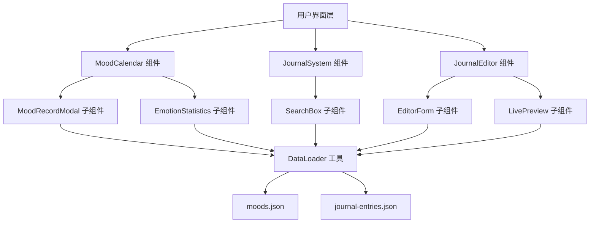
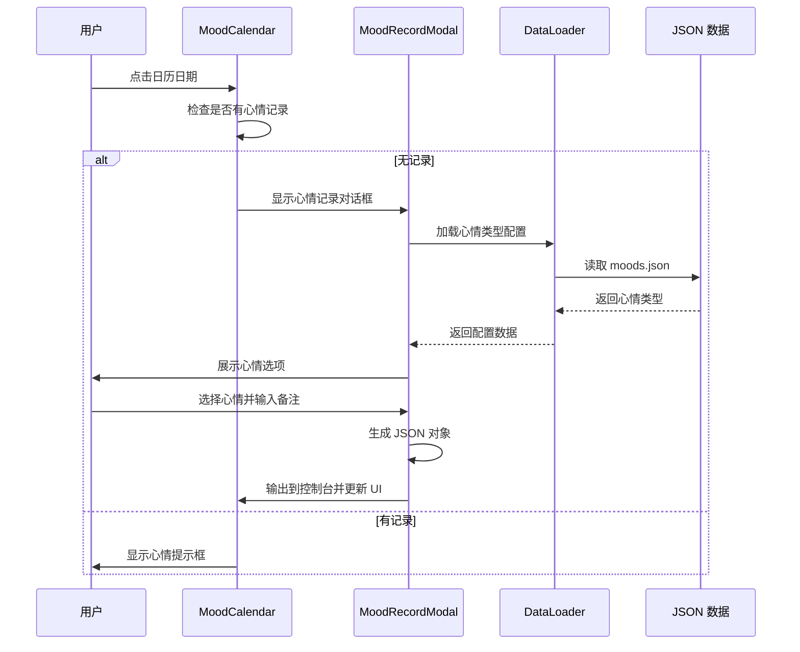

# 设计文档：心情记录和日志系统增强

## 概述

本设计文档描述了为 whitefir.top 个人网站增强心情记录和日志系统的技术实现方案。系统将在现有的 MoodCalendar 和 JournalSystem 组件基础上，添加交互式心情记录功能、富文本日志编辑器和智能搜索统计功能。

设计遵循 Whitefir Studio 的核心设计哲学：
- 60-30-10 配色原则（60% 纯黑背景 #050505，30% 玻璃拟态/深灰，10% 强调色）
- 所有交互使用 transition-all duration-300 ease-in-out 动效
- 响应式设计，完美适配移动端和桌面端
- 玻璃拟态效果（bg-white/5 + backdrop-blur-md + border-white/10）

## 架构

### 系统组件图



### 数据流



## 组件和接口

### 1. MoodRecordModal 组件

心情记录对话框组件，负责收集用户的心情数据。

#### 接口定义

```javascript
class MoodRecordModal {
  /**
   * 构造函数
   * @param {Object} config - 配置对象
   * @param {string} config.date - 日期字符串 (YYYY-MM-DD)
   * @param {Object} config.moodTypes - 心情类型配置对象
   * @param {Function} config.onSave - 保存回调函数
   * @param {Function} config.onClose - 关闭回调函数
   */
  constructor(config)
  
  /**
   * 显示对话框
   */
  show()
  
  /**
   * 隐藏对话框
   */
  hide()
  
  /**
   * 渲染对话框 HTML
   * @returns {string} HTML 字符串
   */
  render()
  
  /**
   * 处理心情选择
   * @param {string} moodKey - 心情类型键
   */
  selectMood(moodKey)
  
  /**
   * 处理保存操作
   */
  handleSave()
  
  /**
   * 生成心情记录数据对象
   * @returns {Object} 心情记录数据
   */
  generateMoodData()
}
```

#### 数据结构

```javascript
// 输出的心情记录数据格式
{
  date: "2024-01-30",        // 日期 (YYYY-MM-DD)
  mood: "happy",             // 心情类型键
  note: "完成了重要功能",     // 用户备注
  color: "#10b981",          // 心情颜色（从 moodTypes 获取）
  timestamp: 1706601600000   // 时间戳
}
```

### 2. EmotionStatistics 组件

情绪统计面板组件，展示当前月份的心情分布。

#### 接口定义

```javascript
class EmotionStatistics {
  /**
   * 构造函数
   * @param {string} containerId - 容器元素 ID
   * @param {Array} moods - 心情记录数组
   * @param {Object} moodTypes - 心情类型配置
   * @param {Date} currentMonth - 当前月份
   */
  constructor(containerId, moods, moodTypes, currentMonth)
  
  /**
   * 渲染统计面板
   */
  render()
  
  /**
   * 计算心情频率
   * @returns {Object} 心情频率统计对象
   */
  calculateMoodFrequency()
  
  /**
   * 渲染进度条
   * @param {string} moodKey - 心情类型键
   * @param {number} percentage - 百分比
   * @returns {string} 进度条 HTML
   */
  renderProgressBar(moodKey, percentage)
  
  /**
   * 更新统计数据
   * @param {Array} moods - 新的心情记录数组
   * @param {Date} currentMonth - 新的月份
   */
  update(moods, currentMonth)
}
```

### 3. JournalEditor 组件

日志编辑器组件，提供富文本编辑和实时预览功能。

#### 接口定义

```javascript
class JournalEditor {
  /**
   * 构造函数
   * @param {string} containerId - 容器元素 ID
   */
  constructor(containerId)
  
  /**
   * 初始化编辑器
   */
  async init()
  
  /**
   * 渲染编辑器界面
   */
  render()
  
  /**
   * 处理表单输入变化
   */
  handleInputChange()
  
  /**
   * 更新实时预览
   */
  updatePreview()
  
  /**
   * 处理提交操作
   */
  handleSubmit()
  
  /**
   * 生成日志条目数据
   * @returns {Object} 日志条目数据
   */
  generateJournalEntry()
  
  /**
   * 验证表单数据
   * @returns {boolean} 是否有效
   */
  validateForm()
}
```

#### 数据结构

```javascript
// 输出的日志条目数据格式
{
  id: "journal-1706601600000",  // 唯一标识符（时间戳）
  title: "日志标题",             // 标题
  date: "2024-01-30",           // 日期 (YYYY-MM-DD)
  excerpt: "日志摘要...",        // 摘要
  content: "<p>正文内容...</p>", // HTML 格式的正文
  tags: ["tag1", "tag2"],       // 标签数组
  mood: "happy",                // 关联的心情类型（可选）
  readTime: 5,                  // 预估阅读时间（分钟）
  detailPage: "#",              // 详情页链接（暂时为 #）
  timestamp: 1706601600000      // 时间戳
}
```

### 4. SearchBox 组件

搜索框组件，提供实时模糊搜索功能。

#### 接口定义

```javascript
class SearchBox {
  /**
   * 构造函数
   * @param {string} containerId - 容器元素 ID
   * @param {Function} onSearch - 搜索回调函数
   */
  constructor(containerId, onSearch)
  
  /**
   * 渲染搜索框
   */
  render()
  
  /**
   * 处理搜索输入
   * @param {string} query - 搜索查询
   */
  handleSearch(query)
  
  /**
   * 清空搜索
   */
  clear()
}
```

## 数据模型

### 心情记录数据模型

```javascript
// moods.json 结构
{
  moodTypes: {
    [key: string]: {
      color: string,    // 十六进制颜色值
      icon: string,     // Emoji 图标
      label: string     // 中文标签
    }
  },
  moods: [
    {
      date: string,     // YYYY-MM-DD
      mood: string,     // 心情类型键
      note: string,     // 备注
      color: string     // 颜色（冗余，便于查询）
    }
  ]
}
```

### 日志条目数据模型

```javascript
// journal-entries.json 结构
{
  entries: [
    {
      id: string,           // 唯一标识符
      title: string,        // 标题
      date: string,         // YYYY-MM-DD
      excerpt: string,      // 摘要
      content: string,      // HTML 内容
      tags: string[],       // 标签数组
      mood: string,         // 关联心情（可选）
      readTime: number,     // 阅读时间（分钟）
      detailPage: string    // 详情页链接
    }
  ]
}
```

## 正确性属性

*属性是一种特征或行为，应该在系统的所有有效执行中保持为真——本质上是关于系统应该做什么的正式陈述。属性作为人类可读规范和机器可验证正确性保证之间的桥梁。*

### 属性 1：心情记录对话框显示逻辑

*对于任何*没有心情记录的日期，当用户点击该日期时，系统应该显示心情记录对话框。

**验证：需求 1.1**

### 属性 2：心情选项完整性

*对于任何*心情类型配置对象，心情记录对话框应该展示配置中定义的所有心情选项（包含图标和标签）。

**验证：需求 1.2**

### 属性 3：心情记录数据格式正确性

*对于任何*有效的心情选择和备注输入，生成的心情记录数据对象应该包含 date、mood、note、color 字段，且格式与 moods.json 兼容。

**验证：需求 1.3, 5.1, 5.3**

### 属性 4：UI 状态更新一致性

*对于任何*完成的心情记录操作，系统应该在控制台输出生成的 JSON 对象，并且日历 UI 应该反映新的心情状态。

**验证：需求 1.4**

### 属性 5：对话框外部点击关闭

*对于任何*打开的心情记录对话框，当用户点击对话框外部区域时，对话框应该自动关闭。

**验证：需求 1.6**

### 属性 6：响应式布局适配

*对于任何*屏幕尺寸（包括移动设备），心情记录对话框和日志编辑器应该正确适配并保持可用性。

**验证：需求 1.8, 2.9**

### 属性 7：心情颜色一致性

*对于任何*心情类型，在日志编辑器的"关联今日心情"下拉菜单中显示的颜色应该与 Mood_Types_Config 中定义的颜色一致。

**验证：需求 2.4, 3.8**

### 属性 8：实时预览同步

*对于任何*在日志编辑器中的输入变化，左侧预览区域应该实时更新以反映当前内容。

**验证：需求 2.5**

### 属性 9：日志条目数据格式正确性

*对于任何*有效的日志表单输入，生成的日志条目数据对象应该包含 id、title、excerpt、content、tags、mood、date、readTime、detailPage 字段，且格式与 journal-entries.json 兼容。

**验证：需求 2.7, 5.2, 5.4**

### 属性 10：搜索过滤正确性

*对于任何*搜索查询和日志数据集，搜索结果应该仅包含标题或摘要中包含查询文本的日志条目。

**验证：需求 3.2, 3.3**

### 属性 11：情绪统计准确性

*对于任何*给定月份的心情数据，情绪统计面板应该正确计算每种心情的出现频率，并以百分比进度条形式展示。

**验证：需求 3.6, 3.7**

### 属性 12：月份切换数据同步

*对于任何*日历月份切换操作，情绪统计面板应该更新以反映新月份的心情分布数据。

**验证：需求 3.10**

### 属性 13：交互元素视觉反馈

*对于任何*可点击元素，当用户 hover 时应该提供视觉反馈（如轻微放大、亮度提升或边框变化）。

**验证：需求 4.4**

### 属性 14：图片可访问性

*对于任何*图片元素，都应该包含有意义的 alt 属性。

**验证：需求 4.10**

### 属性 15：唯一标识符生成

*对于任何*两次独立的 ID 生成操作，生成的标识符应该是唯一的（使用时间戳或 UUID）。

**验证：需求 5.5**

## 错误处理

### 1. 数据加载错误

**场景**：无法加载 moods.json 或 journal-entries.json

**处理策略**：
- 捕获网络请求错误
- 在控制台输出警告信息
- 使用空数组作为默认值
- 向用户显示友好的错误提示（玻璃拟态卡片样式）

**实现**：
```javascript
try {
  const data = await dataLoader.fetchJSON(url);
  return data;
} catch (error) {
  console.warn('[Component] 数据加载失败:', error);
  return { entries: [], moods: [], moodTypes: {} };
}
```

### 2. 表单验证错误

**场景**：用户提交空标题或无效数据

**处理策略**：
- 在提交前验证所有必填字段
- 显示内联错误提示（红色边框 + 错误文本）
- 阻止表单提交直到数据有效
- 使用平滑动画突出显示错误字段

**验证规则**：
- 标题：非空，最大 100 字符
- 摘要：非空，最大 200 字符
- 正文：非空
- 标签：至少一个，每个标签最大 20 字符

### 3. DOM 元素不存在错误

**场景**：容器元素未找到

**处理策略**：
- 在构造函数中检查容器是否存在
- 输出错误日志
- 优雅降级，不执行后续操作

**实现**：
```javascript
if (!this.container) {
  console.error('[Component] 容器元素不存在');
  return;
}
```

### 4. 移动端布局溢出

**场景**：小屏幕设备上内容溢出

**处理策略**：
- 使用响应式断点调整字体大小和间距
- 在 640px 以下缩小日历网格
- 使用 `overflow-x-auto` 处理横向滚动
- 测试常见移动设备尺寸（375px, 414px）

### 5. 心情数据不一致

**场景**：日志条目引用的心情类型在配置中不存在

**处理策略**：
- 使用默认中性灰色 (#6b7280)
- 在控制台输出警告
- 不中断渲染流程

## 测试策略

### 双重测试方法

本系统采用**单元测试**和**属性测试**相结合的方法，确保全面的代码覆盖和正确性验证。

#### 单元测试

单元测试专注于：
- **具体示例**：验证特定输入产生预期输出
- **边缘情况**：空数据、极端值、特殊字符
- **错误条件**：无效输入、网络错误、DOM 不存在
- **集成点**：组件间的交互和数据传递

**示例单元测试**：
```javascript
// 测试空搜索返回所有条目
test('空搜索查询应返回所有日志条目', () => {
  const entries = [
    { title: '日志1', excerpt: '摘要1' },
    { title: '日志2', excerpt: '摘要2' }
  ];
  const result = searchEntries('', entries);
  expect(result).toHaveLength(2);
});

// 测试对话框外部点击关闭
test('点击对话框外部应关闭对话框', () => {
  const modal = new MoodRecordModal(config);
  modal.show();
  document.body.click();
  expect(modal.isVisible()).toBe(false);
});
```

#### 属性测试

属性测试验证通用规则，使用随机生成的输入进行大量测试（最少 100 次迭代）。

**配置**：
- 使用 fast-check（JavaScript）作为属性测试库
- 每个属性测试运行 100 次迭代
- 使用注释标记属性编号和描述

**示例属性测试**：
```javascript
/**
 * Feature: mood-journal-enhancement, Property 3: 心情记录数据格式正确性
 * 对于任何有效的心情选择和备注输入，生成的数据应该包含必需字段
 */
test('属性 3: 心情记录数据格式', () => {
  fc.assert(
    fc.property(
      fc.constantFrom('happy', 'sad', 'excited', 'neutral'),
      fc.string({ minLength: 0, maxLength: 200 }),
      fc.date(),
      (mood, note, date) => {
        const modal = new MoodRecordModal({
          date: formatDate(date),
          moodTypes: mockMoodTypes,
          onSave: jest.fn()
        });
        modal.selectMood(mood);
        modal.setNote(note);
        const data = modal.generateMoodData();
        
        // 验证必需字段存在
        expect(data).toHaveProperty('date');
        expect(data).toHaveProperty('mood');
        expect(data).toHaveProperty('note');
        expect(data).toHaveProperty('color');
        
        // 验证数据类型
        expect(typeof data.date).toBe('string');
        expect(typeof data.mood).toBe('string');
        expect(typeof data.note).toBe('string');
        expect(typeof data.color).toBe('string');
      }
    ),
    { numRuns: 100 }
  );
});

/**
 * Feature: mood-journal-enhancement, Property 10: 搜索过滤正确性
 * 对于任何搜索查询，结果应该仅包含匹配的条目
 */
test('属性 10: 搜索过滤正确性', () => {
  fc.assert(
    fc.property(
      fc.array(fc.record({
        title: fc.string(),
        excerpt: fc.string()
      })),
      fc.string(),
      (entries, query) => {
        const results = searchEntries(query, entries);
        
        // 所有结果都应该匹配查询
        results.forEach(entry => {
          const matchesTitle = entry.title.toLowerCase().includes(query.toLowerCase());
          const matchesExcerpt = entry.excerpt.toLowerCase().includes(query.toLowerCase());
          expect(matchesTitle || matchesExcerpt).toBe(true);
        });
      }
    ),
    { numRuns: 100 }
  );
});
```

### 测试覆盖目标

- **单元测试**：覆盖所有公共方法和边缘情况
- **属性测试**：覆盖所有设计文档中定义的正确性属性
- **集成测试**：验证组件间的数据流和交互
- **视觉回归测试**：确保样式一致性（手动验证）

### 测试执行

由于项目规范禁止创建测试文件，测试策略作为文档保留，供未来实现参考。在实际开发中：
1. 通过浏览器开发者工具手动验证功能
2. 使用控制台日志验证数据流
3. 在多种设备和屏幕尺寸上测试响应式布局
4. 验证所有交互动画的流畅性

## 实现细节

### 1. MoodRecordModal 实现

**HTML 结构**：
```html
<div id="mood-record-modal" class="fixed inset-0 z-50 flex items-center justify-center hidden">
  <!-- 背景遮罩 -->
  <div class="modal-backdrop absolute inset-0 bg-black/60 backdrop-blur-sm"></div>
  
  <!-- 对话框内容 -->
  <div class="modal-content relative glass-card rounded-2xl p-8 max-w-md w-full mx-4">
    <!-- 标题 -->
    <h3 class="text-2xl font-bold tracking-tighter mb-6">记录今日心情</h3>
    
    <!-- 日期显示 -->
    <p class="text-white/50 text-sm mb-6">2024-01-30</p>
    
    <!-- 心情选项网格 -->
    <div class="mood-options grid grid-cols-3 gap-4 mb-6">
      <!-- 每个心情选项 -->
      <button class="mood-option glass-card p-4 rounded-xl hover:scale-105 transition-all">
        <span class="text-3xl mb-2">😊</span>
        <span class="text-sm">开心</span>
      </button>
    </div>
    
    <!-- 备注输入 -->
    <textarea class="w-full glass-card rounded-xl p-4 resize-none" 
              placeholder="添加备注（可选）"
              rows="3"></textarea>
    
    <!-- 操作按钮 -->
    <div class="flex gap-4 mt-6">
      <button class="btn-secondary flex-1">取消</button>
      <button class="btn-primary flex-1">保存</button>
    </div>
  </div>
</div>
```

**CSS 样式**：
```css
/* 对话框动画 */
.modal-content {
  animation: modalSlideIn 0.3s ease-out;
}

@keyframes modalSlideIn {
  from {
    opacity: 0;
    transform: translateY(-20px) scale(0.95);
  }
  to {
    opacity: 1;
    transform: translateY(0) scale(1);
  }
}

/* 心情选项选中状态 */
.mood-option.selected {
  border: 2px solid var(--mood-color);
  box-shadow: 0 0 20px var(--mood-color);
}
```

### 2. EmotionStatistics 实现

**HTML 结构**：
```html
<div class="emotion-statistics glass-card rounded-2xl p-6 mt-8">
  <h3 class="text-lg font-bold tracking-tighter mb-6">
    <i class="fas fa-chart-pie mr-2 text-purple-400"></i>
    本月情绪统计
  </h3>
  
  <div class="space-y-4">
    <!-- 每种心情的进度条 -->
    <div class="mood-stat">
      <div class="flex justify-between items-center mb-2">
        <span class="flex items-center gap-2">
          <span class="text-xl">😊</span>
          <span class="text-sm font-medium">开心</span>
        </span>
        <span class="text-sm text-white/50">35%</span>
      </div>
      <div class="progress-bar-bg h-2 rounded-full bg-white/10">
        <div class="progress-bar-fill h-full rounded-full transition-all duration-500"
             style="width: 35%; background: #10b981;"></div>
      </div>
    </div>
  </div>
</div>
```

### 3. JournalEditor 实现

**页面布局**（桌面端）：
```html
<div class="journal-editor-container grid lg:grid-cols-2 gap-8">
  <!-- 左侧：编辑表单 -->
  <div class="editor-form">
    <input type="text" placeholder="标题" class="form-input" />
    <textarea placeholder="摘要" class="form-input" rows="3"></textarea>
    <div class="tag-selector"><!-- 标签选择器 --></div>
    <select class="mood-selector"><!-- 心情选择 --></select>
    <textarea placeholder="正文" class="form-input" rows="15"></textarea>
  </div>
  
  <!-- 右侧：实时预览 -->
  <div class="live-preview sticky top-24">
    <h3 class="text-lg font-bold mb-4">预览</h3>
    <div id="preview-card"><!-- 日志卡片预览 --></div>
  </div>
</div>
```

**响应式调整**（移动端）：
```css
@media (max-width: 1023px) {
  .journal-editor-container {
    grid-template-columns: 1fr;
  }
  
  .live-preview {
    position: static;
    order: -1; /* 预览显示在表单上方 */
  }
}
```

### 4. SearchBox 实现

**HTML 结构**：
```html
<div class="search-box glass-card rounded-xl p-4 mb-6">
  <div class="flex items-center gap-3">
    <i class="fas fa-search text-white/50"></i>
    <input type="text" 
           placeholder="搜索日志标题或摘要..." 
           class="flex-1 bg-transparent outline-none"
           id="journal-search-input" />
    <button class="clear-search hidden text-white/50 hover:text-white">
      <i class="fas fa-times"></i>
    </button>
  </div>
</div>
```

**搜索逻辑**：
```javascript
handleSearch(query) {
  const normalizedQuery = query.toLowerCase().trim();
  
  if (!normalizedQuery) {
    // 空查询，显示所有条目
    this.onSearch(this.allEntries);
    return;
  }
  
  // 模糊搜索：匹配标题或摘要
  const results = this.allEntries.filter(entry => {
    const titleMatch = entry.title.toLowerCase().includes(normalizedQuery);
    const excerptMatch = entry.excerpt.toLowerCase().includes(normalizedQuery);
    return titleMatch || excerptMatch;
  });
  
  this.onSearch(results);
}
```

## 性能优化

### 1. 防抖搜索输入

使用防抖技术减少搜索频率：
```javascript
const debouncedSearch = debounce((query) => {
  this.handleSearch(query);
}, 300);
```

### 2. 虚拟滚动（可选）

如果日志条目超过 100 条，考虑实现虚拟滚动以提升性能。

### 3. 图片懒加载

所有图片使用 `loading="lazy"` 属性。

### 4. CSS 动画优化

仅使用 `

